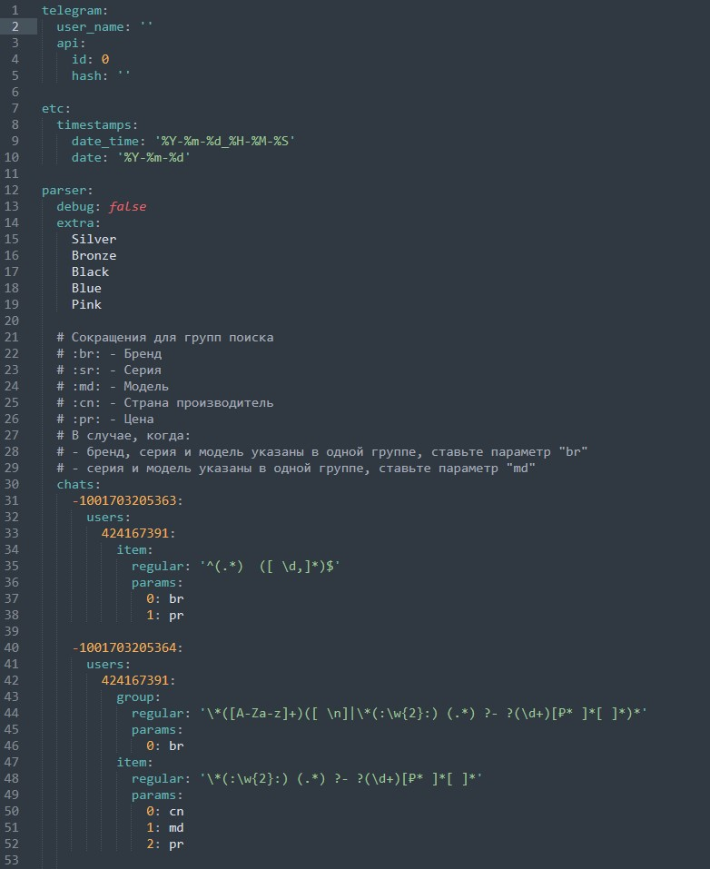
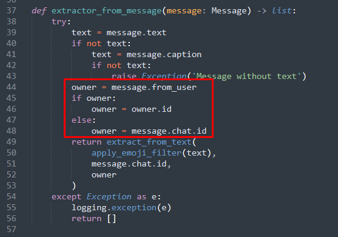
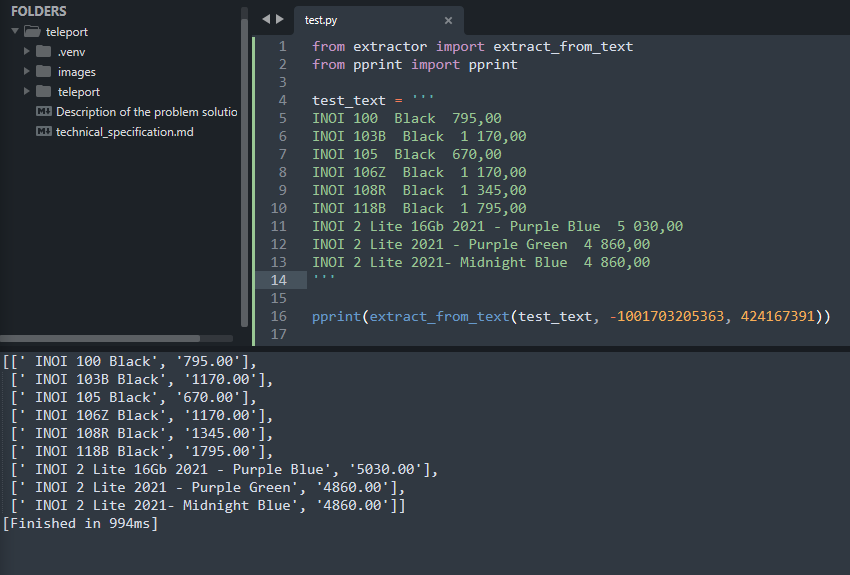
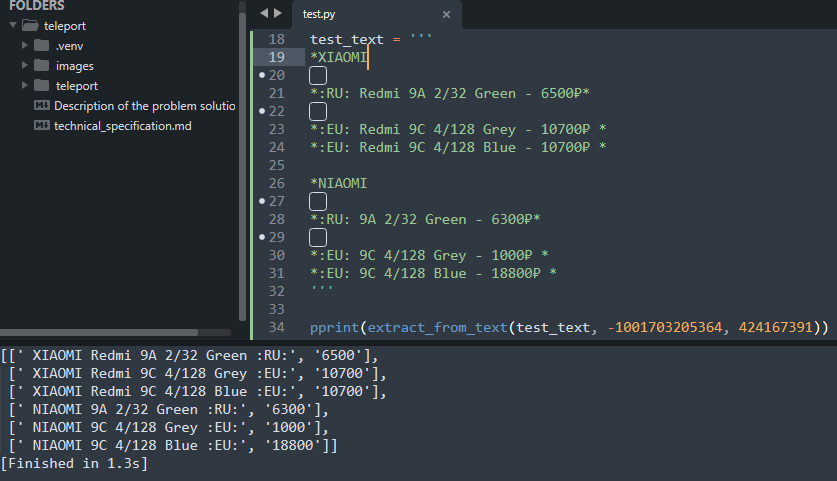
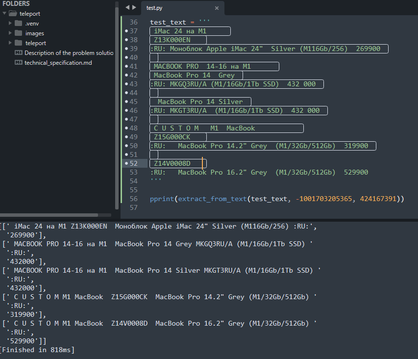

><ins>Тестовое задание заключается в доработке готового скрипта на Python.
</ins>

## Не трогаем, что хорошо работает!

Первое на что упал мой взор - это реализация бота для взаимодействия с клиентским API Telegram. В реализацию хендлеров
не полез, т.к. после пары тестовых запусков убедился, что бот получает абсолютно все сообщения.

В настройках бота явно указываются идентификаторы чатов и пользователей, которых нужно слушать. Я решил организовать
хранение всех статических данных в отдельном файле, для последующей модернизации программы. Для хранения конфигурации
сервиса выбрал язык разметки `YAML` с расширением для файла `.yml`. Для работы с данным форматом установил библиотеку 
**Pyyaml**.

> Не забываем добавить библиотеку в `requirements.txt`

Т.к. программа должна собирать данные о товарах нас интересует несколько ключевых параметров бренд, серия, модель,
страна производитель и стоимость товара. Явно определить их распожение будет проблематично, т.к. публикующие каналы
отличаются форматом подачи интересующего нас контента. На помощь к нам придут регулярные выражения, которые будут
составлять разработчики при добавлении нового источника.

Контент в сообщениях разбивается на уровни:
- группа (`group`)
- подгруппа (`subgroup`)
- элемент (`item`).

Разработчики смогут указать, какие уровни есть в публикации, прописать регулярное выражение и собираемые на данном
уровне параметры.

Теперь перейдём к функции отвечающей за обработку текстов сообщений `extract_from_text(text: str) -> list`.
Как видно из кода, она принимает текстовое сообщение и возвращает спиок. немного покопавшись в коде, понимаю, что она
возвращает список со списками из двух строк: бренд, серия, модель в одной строке и цена во второй.

Для работы с разными шаблонами мы должны принимать не только сам текст, но и иметь нужные для последующей обработки
настройки. Т.к. информация о шаблонах хранится в словарях, нам потребуется два ключа (id чата и id публикатора). Чтобы
их получить, добавим эти параметры.

Единственное место, где вызываетс данная функция - функция `extractor_from_message` в файле **bot.py**. Для корректной
передачи параметров я добавил проверку на наличие отправителя, т.к в случае, если сообщение отправили от имени чата,
отправителем является чат.

Теперь можно приступить к разработке самого алгоритма поиска.
Для хранения данных на каждом слое я использовал словари с ключами **br, sr, md, cn, pr**.

Добавил две функции для работы со словарями:
- `create_dict(obj: tuple, params: dict) -> dict` - соотносит параметры шаблона с полученными данными, возвращает словарь.
- `get_list(obj: dict) -> list` - конвертирует словарь в список, состоящий из двух элементов. Функция нужна для
унификации вывода программы.

В функции `get_group(text: str, ftype: str, config: dict) -> list` осуществляется поиск групп и подгрупп. Для этого мы ищем
последнее вхождение элемента, делаем срез текста до данного значения и отправляем на уровень ниже. Помимо этого функция 
извлекает параметры из данного уровня, обрабатывает и присоеденяет к полученному с нижних уровней результату. С каждым
уровнем мы извлекаем из переданного словаря конфигурации `config` текущий. Параметр `ftype` отвечает за тип уровня(группа
или подгруппа).
`search(text: str, msg_config: dict) -> list` - определяет логику поведения на кждом уровне. При достижении уровня
элементов она собирает и вовращает значения.

В функции `extract_from_text()`:
- получает конфигурацию для обработки данного сообщения по id чата и пользователя
- вызывает функцию `search()`
- форматирует в списки вызовом функции `get_list()`

Для проверки работы функции взял три тестовых набора с предоставленных телеграмм каналов:
1. Состоит только из элементов
2. Состоит из групп и элементов
3. Состоит из групп, подгрупп и элементов

